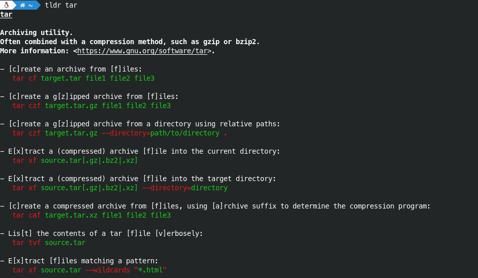

# tldr-sharp

[](https://travis-ci.org/principis/tldr-sharp)

A C# based command-line client for [tldr](https://github.com/tldr-pages/tldr).



## Requirements
Because of TLS 1.2 support Mono >= 4.8 is required. If your distro comes with an older version, please install the [latest stable](https://www.mono-project.com/download/stable/).
* Mono >= 4.8 because of TLS 1.2 support

## Installing
### Linux
Download and execute the install script from the latest [release](https://github.com/principis/tldr-sharp/releases).
```
wget <linux_install.sh url>
chmod +x linux_install.sh
./linux_install.sh
```

#### Manual
Download and extract the latest [release](https://github.com/principis/tldr-sharp/releases).
```
mkdir tldr
tar xzf v1.1.1.tar.gz -C tldr
sudo mv tldr /usr/local/lib
cd /usr/local/bin
sudo wget https://raw.githubusercontent.com/principis/tldr-sharp/master/tldr
sudo chmod +x tldr
```

### Windows
Extract the latest [release](https://github.com/principis/tldr-sharp/releases) and download the latest  [sqlite3 dll](https://www.sqlite.org/download.html). 
Extract the dll in the same folder as tldr_sharp.exe.

## Usage
```
Usage: tldr command [options]
Simplified and community-driven man pages
  -h, --help                 Display this help text.
  -l, --list                 Show all pages for the current platform
  -a, --list-all             Show all pages
  -u, --update               Update the local cache.
  -c, --clear-cache          Clear the local cache.
      --os=VALUE             Override the default OS
      --list-os              List all OS's
      --lang=VALUE           Override the default language
      --list-languages       List all languages
```

## License

This project is licensed under the GPL license - see the [LICENSE](LICENSE) file for details

## Contributing
This project is the result of a friday night boredom. I only tested it on Ubuntu 18.04 but should be able to run on every platform which supports mono.

Contributions are always welcome!
